# A microservices-based architecture application deployed on Kubernetes.


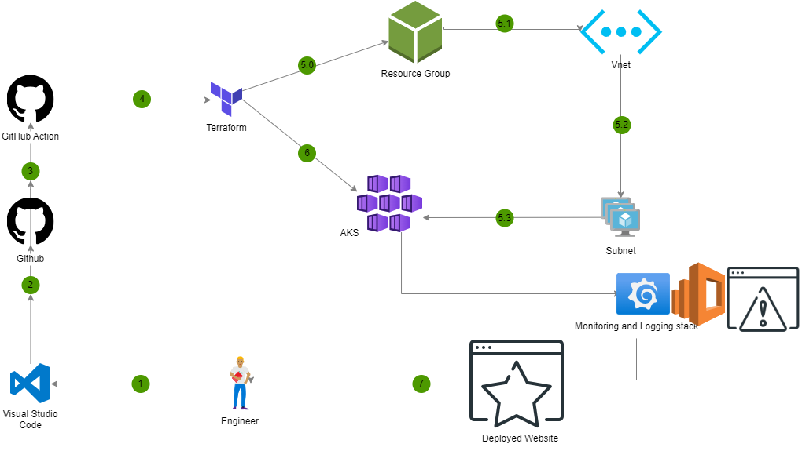

I aim to deploy a microservices-based application, specifically the Socks Shop, using a modern approach that emphasizes automation and efficiency. The goal is to use Infrastructure as Code (IaaC) for rapid and reliable deployment on Kubernetes.

This project will be implemented with Terraform(Iac), GitHub Actions(ci/cd), Kubernetes(container orchestration), Helm, Prometheus, and ELK Stack(logging).

## Project Requirements
Socks Shop Application

Terraform

Azure Account

Kubernetes

Kubectl

Github Account(for github action)

Helm

Prometheus

ELK Stack


## Deliverables

- Deployed using an Infrastructure as Code approach(Terraform).
- Application deployment should be clear, readable and maintainable.
- Deploy pipeline
- Metrics (Alertmanager)
- Monitoring (Grafana)
- Logging (Prometheus)
- You can use an IaaS provider of your choice(I will be using Azure).
- The application should run on Kubernetes


## Getting Started

Socks-shop application: https://github.com/microservices-demo/microservices-demo.github.io

Demo: https://github.com/microservices-demo/microservices-demo/tree/master
## Provison Infrastructure

With Terraform, we will provision the necessary infrastructure resources on Azure[resource group, vn, subnets and eks].

* Confirm you have azure cli and Terraform installed with the commands:
```bash
  az --version

  terrform --version

  kubectl version
```
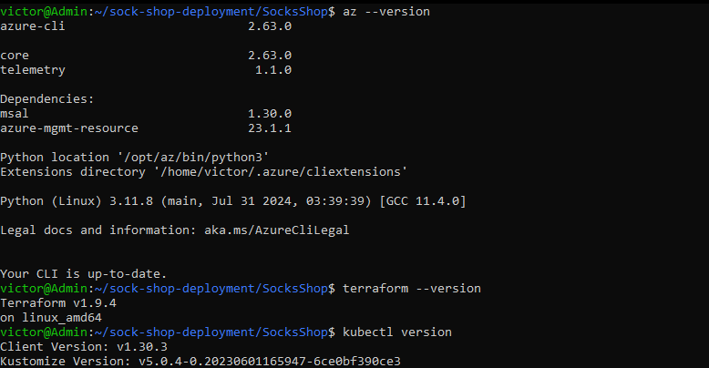

* Git clone this repository and navigate to the infrastructure folder.
```bash
    https://github.com/victor-ok/sock-shop-deployment.git

    cd infrastructure
```

* Run the following commands to initialize, plan and apply the main.tf
```bash
    terraform init

    terraform plan
    
    terraform apply
```
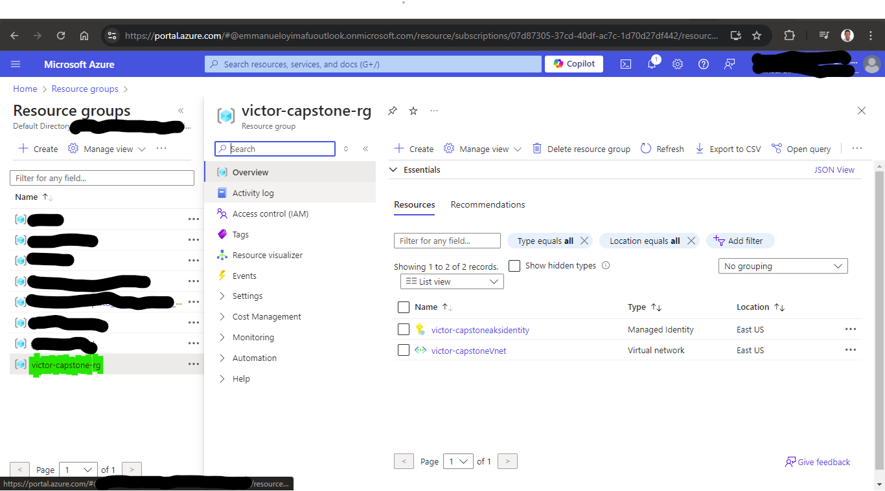
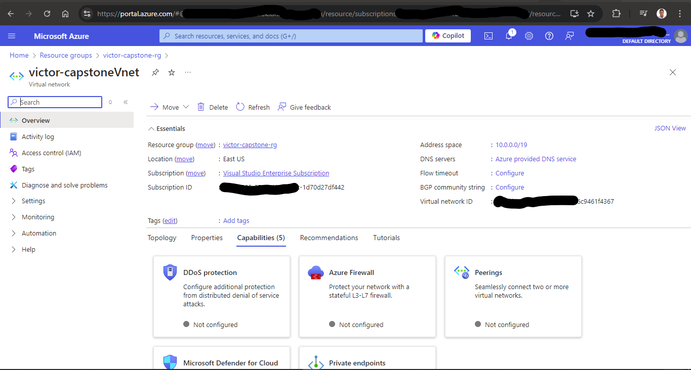
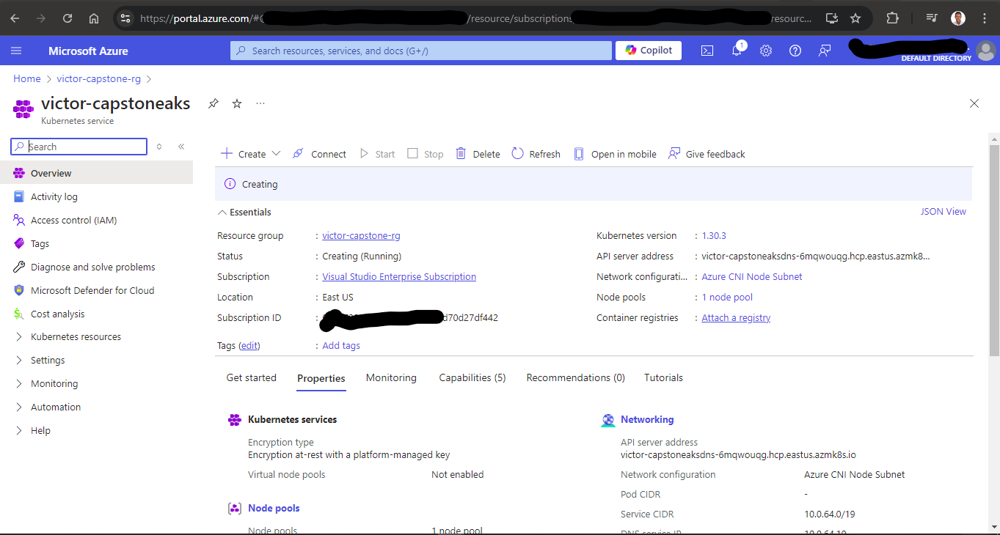

* Your resources should be running after a short while. Use this command to test the AKS cluster
```bash
  az aks get-credentials --resource-group <resource-group-name> --name <aks-cluster-name>
```
The `az aks get-credentials` command is used to get the access credentials for the AKS cluster.

## Deploy kube application
* We apply `kubectl` to deploy our application manifest with the following commands:
```bash
  cd ../k8s
```
This is the location of the manifest file to deploy.
```bash
    kubectl apply -f deploy.yml
```

* We can verify our deployment with the command
```bash
  kubectl get all -A
```
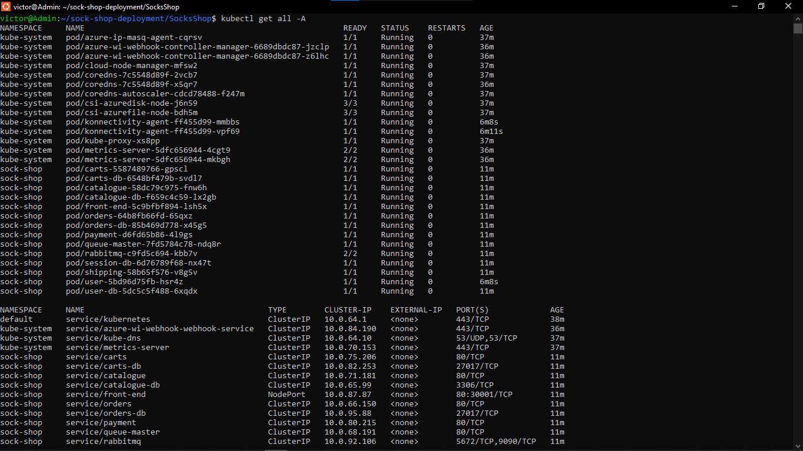

* We can test that our application is serving the frontend by port-forwarding
```bash
  kubectl port-forward service/front-end -n sock-shop 30001:80
```

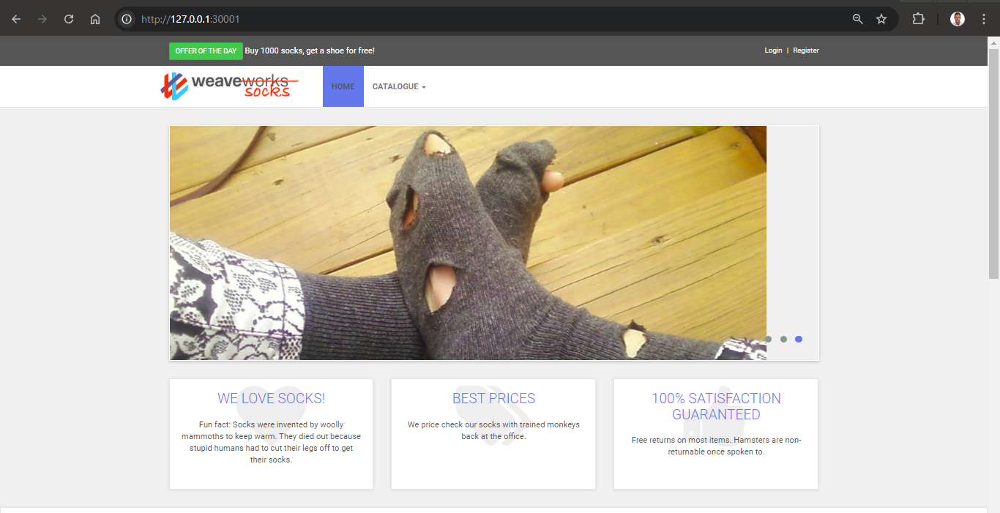

* After visualizing we can go ahead to destroy the resources
```bash
  terraform destroy -auto-approve
```

# Montoring

First navigate into the monitoring folder  and create the monitoring namespace using the `00-monitoring-ns.yaml` file:

```bash
cd Monitoring

$ kubectl create -f 00-monitoring-ns.yaml
```

### Prometheus

To deploy simply apply all the prometheus manifests (01-10) in any order:

`kubectl apply $(ls *-prometheus-*.yaml | awk ' { print " -f " $1 } ')`

The prometheus server will be exposed on Nodeport `31090`.
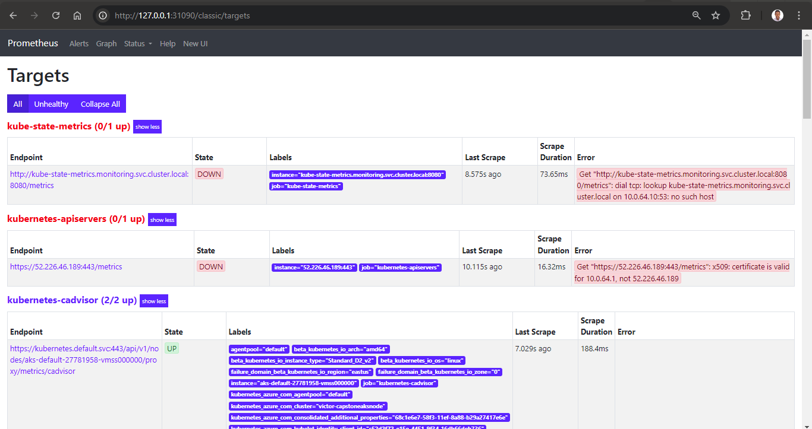

### Grafana

First apply the grafana manifests from 20 to 22:

`kubectl apply $(ls *-grafana-*.yaml | awk ' { print " -f " $1 }'  | grep -v grafana-import)`

Once the grafana pod is in the Running state apply the `23-grafana-import-dash-batch.yaml` manifest to import the Dashboards:

`kubectl apply -f 23-grafana-import-dash-batch.yaml`

Grafana will be exposed on the NodePort `31300` 
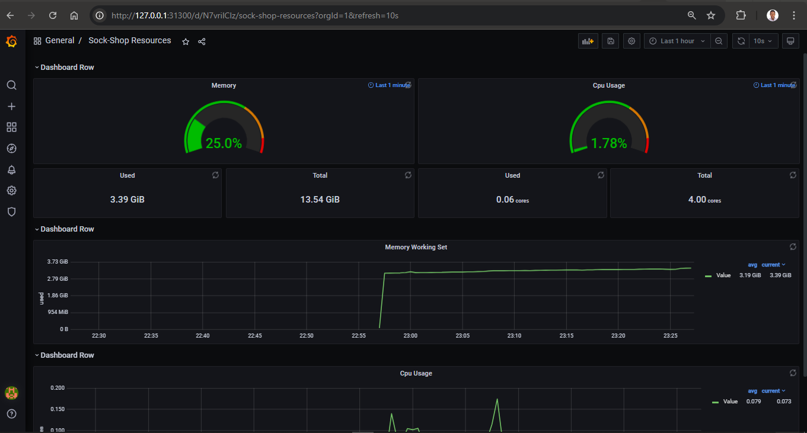
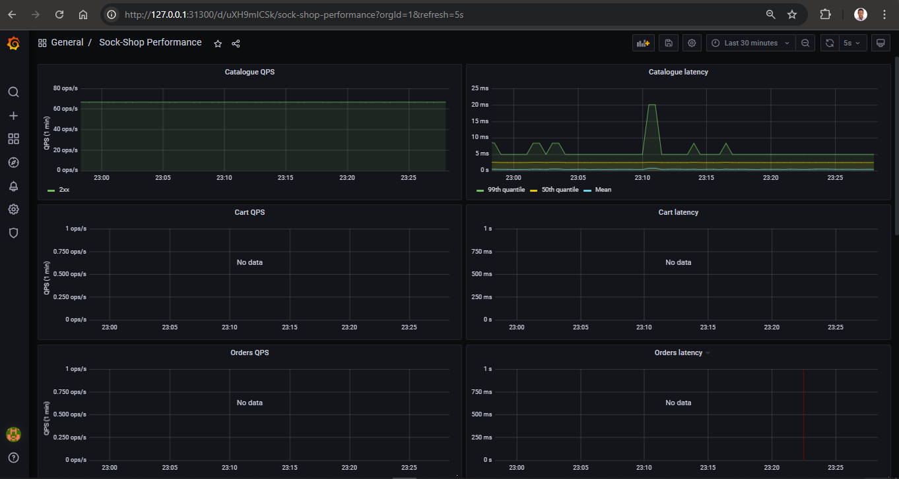
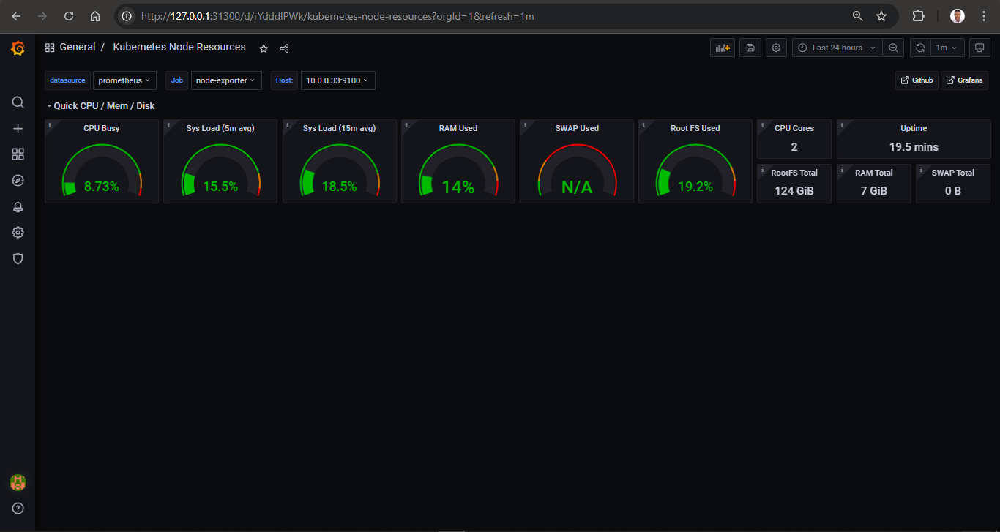